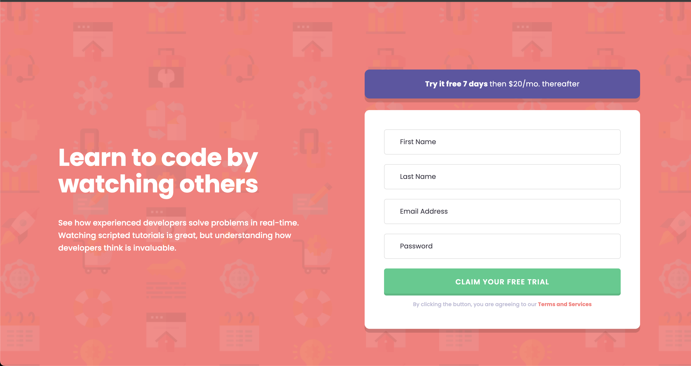
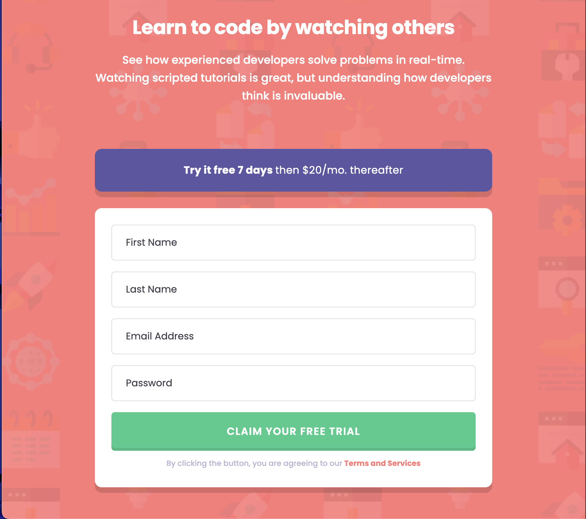

# Frontend Mentor - Intro component with sign up form solution

This is a solution to the [Intro component with sign up form challenge on Frontend Mentor](https://www.frontendmentor.io/challenges/intro-component-with-signup-form-5cf91bd49edda32581d28fd1). Frontend Mentor challenges help you improve your coding skills by building realistic projects.

## Table of contents

- [Overview](#overview)
  - [The challenge](#the-challenge)
  - [Screenshot](#screenshot)
  - [Links](#links)
- [My process](#my-process)
  - [Built with](#built-with)
  - [What I learned](#what-i-learned)
  - [Continued development](#continued-development)
  - [Useful resources](#useful-resources)
- [Author](#author)

## Overview

### The challenge

Users should be able to:

- View the optimal layout for the site depending on their device's screen size
- See hover states for all interactive elements on the page
- Receive an error message when the `form` is submitted if:
  - Any `input` field is empty. The message for this error should say _"[Field Name] cannot be empty"_
  - The email address is not formatted correctly (i.e. a correct email address should have this structure: `name@host.tld`). The message for this error should say _"Looks like this is not an email"_

### Screenshot




### Links

- Solution URL: [Solution](https://github.com/hectorlil48/intro-component-with-sign-up-form)
- Live Site URL: [Live site](https://hectorlil48.github.io/intro-component-with-sign-up-form/)

## My process

### Built with

- Semantic HTML5 markup
- Flexbox
- Mobile-first workflow
- [React](https://reactjs.org/) - JS library
- [TailWindCss](https://tailwindcss.com/) - CSS Framework

### What I learned

This was my first time using Tailwind CSS with React. At first, I wasn’t sure how it would fit into a React project, but following the Tailwind documentation made the setup and usage surprisingly easy. I learned how to structure my components with utility classes and how Tailwind’s approach speeds up styling without having to write a lot of custom CSS. Overall, it gave me a better understanding of how to build responsive, clean designs directly in my React components.

```r
className={`${inputBaseStyles} transition-colors duration-300 ease-in-out ${errors.lastName ? "focus:border-firered border-2 border-red-500" : "border-border-grey focus:border-cta-purple border"}`}
```

### Continued development

I plan to keep improving my skills with Tailwind CSS by exploring more advanced features like custom configurations, animations, and responsive design techniques. I also want to practice combining Tailwind with component libraries and integrating it into larger React projects to make my workflow even faster and more efficient.

### Useful resources

- [TailWindCss](https://tailwindcss.com/) - It was my first time using Tailwind on a project, and the documentation made it incredibly easy to learn. Their docs are well-written and made the whole process smooth.
- [ChatGPT](https://chatgpt.com/) - This tool was invaluable for brainstorming ideas, refining technical descriptions, and troubleshooting code efficiently. I appreciated how it provided clear examples and explanations tailored to my projects.
- [React.dev](https://react.dev/) - The official React documentation was my go-to for understanding core concepts like state management, hooks, and component lifecycle. It helped me structure my app efficiently and follow best practices.

## Author

- GitHub - [Hector Ramirez](https://github.com/hectorlil48)
- Frontend Mentor - [@hectorlil48](https://www.frontendmentor.io/profile/hectorlil48)
- LinkedIn - [@linkedin.com/in/hector-ramirez-6a6509170](https://www.linkedin.com/in/hector-ramirez-6a6509170/)
